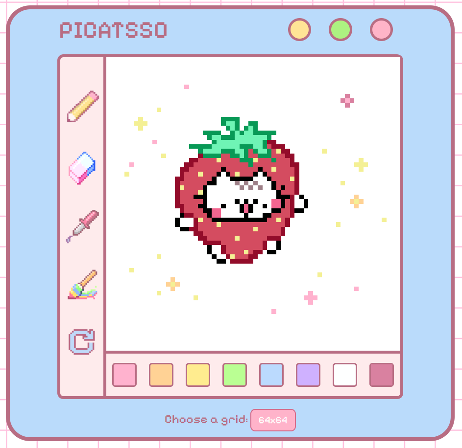

# Etch-a-Sketch

> A simple pixel art web application: draw, erase, and pick colors 🎨🐱

---

## 🖼️ Preview

  

<em>Unleash your inner pixel artist!</em>

---

## ✨ Features

- **Pixel Grid Drawing**: Click & drag to draw on a grid.
- **Tool Palette**:
  - 🖌️ Pencil: draw single pixels
  - 🩹 Eraser: remove pixels one by one
  - 🎨 Color Picker: sample existing colors from the canvas
  - 🌈 Rainbow Brush: fill multiple pixels in one drag
  - 🔄 Reset: clear the entire grid in one click
- **Color Palette**: 8 vibrant colors
- **Grid Size Selector**: switch between resolutions (16×16, 32×32, 64×64)

---

## 🎮 How to Use

1. **Select a Tool** from the left toolbar:
   - Pencil 🖌️ for fine lines
   - Eraser 🩹 to fix mistakes
   - Color Picker 🎨 to match existing pixels
   - Rainbow Brush 🌈 for random colors
   - Reset 🔄 to clear the grid
2. **Choose a Color** from the bottom palette.
3. **Draw** by clicking and dragging on the canvas.
4. **Adjust Grid Size** with the button below the palette.

---

## 📝 Code Structure

- **`index.html`** – Main HTML layout
- **`style.css`** – Styling
- **`script.js`** – Drawing logic and event handlers
- **`images/`** – Assets
